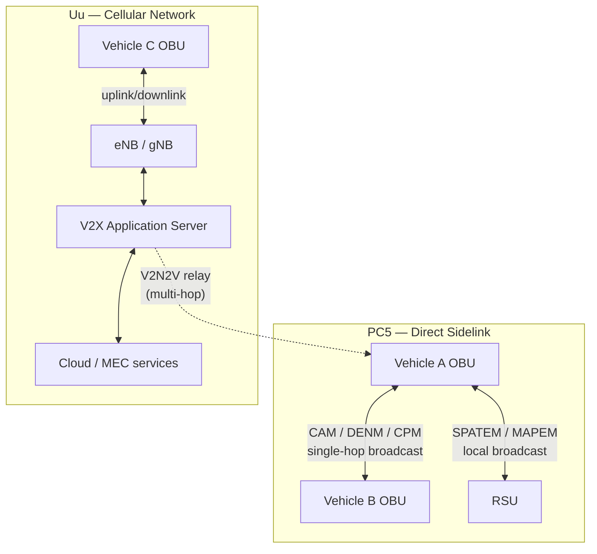

**Last reviewed: 2026-07-19**

# PC5 vs Uu — the two C-V2X interfaces

C-V2X splits into two distinct 3GPP interfaces. They aren't alternative encodings of the same thing — they're different topologies serving different jobs, and a real deployment typically uses both.

## At a glance

| | PC5 (sidelink) | Uu (cellular) |
|---|---|---|
| Topology | Direct device-to-device, single-hop, broadcast | Through the mobile network; uplink/downlink; can be multi-hop (V2N2V / V2N2I) |
| Coverage dependency | None — works with no network present | Requires cellular coverage |
| Latency | Low — no network round-trip | Higher — network round-trip, infrastructure-dependent |
| Radio generations | LTE-V2X (Rel-14, "Mode 4"), NR-V2X sidelink (Rel-16+) | LTE-Uu, NR-Uu (NSA and SA deployments) |
| Typical facilities messages | CAM, DENM, CPM, VAM, SPATEM (local broadcast) | DENM (wide-area relay), MAPEM, V2N services generally |
| Application-layer standardization | Tight — ETSI TS 103 900/103 831/103 324 map directly onto PC5 broadcast | Loose — the *radio* is 3GPP-standard, but the V2X Application Server behavior, backend APIs, and cloud integration are largely operator/OEM-defined |

## Why the Uu side feels less standardized

The ETSI facilities-layer messages (CAM, DENM, etc.) are **transport-agnostic by design** — nothing in the message specs ties a message type to a specific radio interface. What's under-standardized is the *backend*: how a V2X Application Server aggregates, relays, or re-broadcasts messages received over Uu, and what contract exists between that server and cloud/MEC services. This is filled today by a patchwork of C-ROADS profiles, 5GAA system profiles, and individual MNO platforms — not a single ETSI deliverable the way the PC5 message set has one.

## Topology diagram

## When each is chosen

- **PC5** for safety-critical, latency-sensitive, local broadcast — you don't want a hazard warning waiting on a network round-trip.
- **Uu** for wide-area relay, backend aggregation, cloud analytics, and anything that benefits from network-level processing (traffic management, fleet-wide hazard correlation, MEC-hosted collective perception fusion across a wider area than PC5's radio range covers).
- Real deployments often duplicate or split messages across both — e.g. an RSU-assisted fusion scheme assigning CAM/CPM/SPATEM to PC5 while routing DENM/MAPEM through Uu, to balance PC5's range/congestion limits against Uu's latency/infrastructure-dependency limits.

## References

- 3GPP TS 23.285 (V2X architecture)
- ETSI EN 303 798 (unified LTE/NR-V2X access layer)
- ETSI TS 103 900 / TS 103 831 (CAM / DENM, Release 2)
