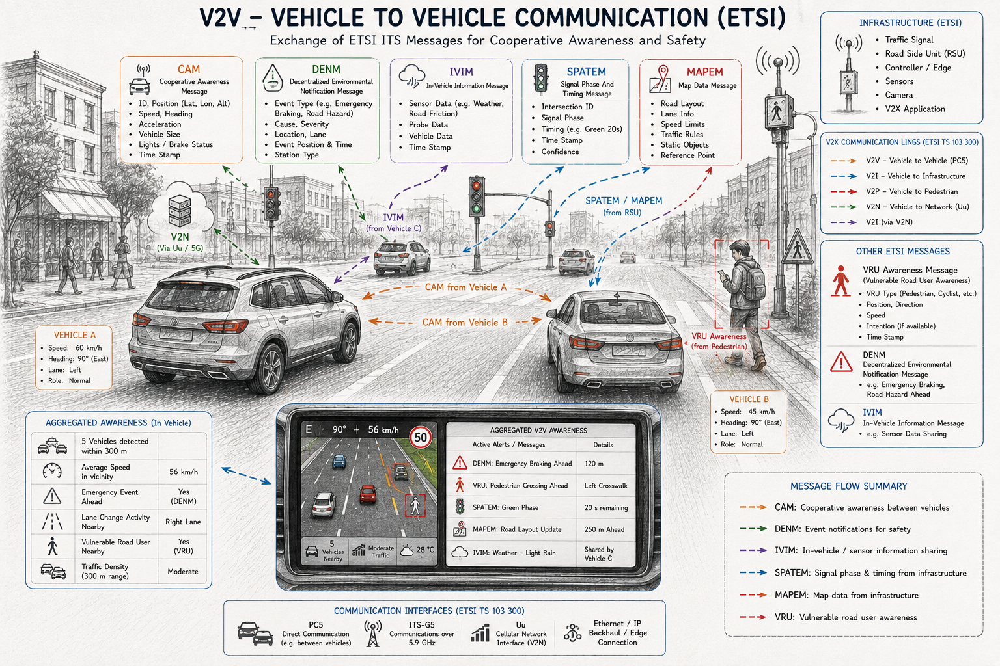

**Last reviewed: 2026-08-08** — sections marked `<!-- verify -->` contain time-sensitive facts (event dates, release status) worth re-checking before relying on them.

# The Hitchhiker's Guide to ETSI C-V2X

*A compact field manual for Cellular Vehicle-to-Everything, ETSI-flavoured. Don't panic — bring a towel and an ASN.1 compiler.*

---

## 1. What It Is

C-V2X (Cellular Vehicle-to-Everything) is the 3GPP-defined radio family for cooperative, connected and automated mobility, standardised for European deployment by **ETSI Technical Committee ITS (TC ITS)**. It's the cellular sibling of ITS-G5 (WiFi-p / 802.11p) — same job (cars, roads and people talking to each other about hazards, intentions and traffic state), different radio underneath.

C-V2X has two communication modes:
- **PC5 (sidelink)** — direct device-to-device, no network needed. This is the safety-critical, low-latency path: vehicle-to-vehicle, vehicle-to-pedestrian, vehicle-to-infrastructure, all broadcast in the 5.9 GHz ITS band. Comes in two flavours: **LTE-V2X** (3GPP Rel-14, "Mode 4") and **NR-V2X** (5G sidelink, Rel-16+).
- **Uu (network/cellular)** — via the mobile network (4G/5G), for vehicle-to-network use cases: cloud services, traffic management centres, over-the-air data, V2N applications, MEC-hosted apps.

ETSI's job isn't to reinvent the radio (that's 3GPP RAN/SA) — it's to define everything that sits *above* the radio so a Renault OBU, a Siemens RSU and a Vodafone-hosted C-ITS server can all understand the same message. That's the ETSI value-add: facilities-layer messages, networking (GeoNetworking/BTP), security, and application layer harmonisation.

---

## 2. The Machine — Components & Architecture

ETSI models everything on the **ITS Station Reference Architecture** (EN 302 665, refreshed as TS 103 898), a layered stack sitting alongside two vertical planes:

```
        Applications layer     (safety, traffic efficiency, infotainment apps)
        ---------------------------------------------------------
        Facilities layer       (CAM, DENM, CPM, VAM, MAPEM, SPATEM...)
        ---------------------------------------------------------
        Networking & Transport (GeoNetworking, BTP, IPv6)
        ---------------------------------------------------------
        Access layer            (LTE-V2X / NR-V2X PC5, Uu, ITS-G5)
        ---------------------------------------------------------
     Management plane  |                     |  Security plane
```

**Access layer** — LTE-V2X access layer is EN 303 613; the Release-2 unified LTE+NR-V2X access layer is **EN 303 798**. These map ETSI's requirements onto 3GPP's PC5/Uu radio specs (36-series for LTE, 38-series for NR).

**Networking & Transport** — GeoNetworking (geo-addressed ad-hoc routing, EN 302 636 series) and the Basic Transport Protocol (BTP) carry facilities-layer messages without needing IP in the safety path.

**Facilities layer** — the part everyone actually cares about: standardised messages, each with its own service spec + ASN.1 schema:

| Message | Purpose | Core spec |
|---|---|---|
| **CAM** – Cooperative Awareness | "Here I am, this is my state" beacon | EN 302 637-2 (R1), TS 103 900 (R2) |
| **DENM** – Decentralized Environmental Notification | Event-triggered hazard warning | EN 302 637-3 (R1), TS 103 831 (R2) |
| **CPM** – Collective Perception | Share locally-sensed objects (radar/camera/lidar fusion) with neighbours | TS 103 324 |
| **VAM** – VRU Awareness | Cyclists/pedestrians broadcasting their own awareness message | TS 103 300-3 |
| **MAPEM** – Map (topology) | Intersection/lane geometry | TS 103 301 |
| **SPATEM** – Signal Phase & Timing | Traffic light state | TS 103 301 |
| **IVIM** – In-Vehicle Information | Variable message signs, roadworks | TS 103 301 |
| **SREM/SSEM** – Signal Request/Status | Priority requests (buses, emergency) | TS 103 301 |
| **RTCMEM** – RTCM correction messages | GNSS correction relay | TS 103 301 |
| **MCM/MCDM** – Manoeuvre Coordination | Cooperative manoeuvre negotiation (emerging, automated driving) | TS 103 561 (draft/ongoing) |

Every one of these is defined twice: once in prose (the service spec) and once formally (the **ASN.1 schema**, see §7) — the ASN.1 is what actually goes over the air, UPER-encoded.



*Illustrative overview of the facilities-layer messages in flight during a typical intersection scene — CAM between vehicles, DENM for hazard events, SPATEM/MAPEM from the RSU, IVIM shared vehicle-to-vehicle, and VRU awareness from a pedestrian's device. Simplified for intuition, not a substitute for the specs in the table above.*

**Security plane** — TS 103 097 defines certificate formats and message signing/encryption (built on IEEE 1609.2 concepts, Europeanised). This underpins the EU's Certificate Policy / Trust List for a single European C-ITS trust domain — every message on the wire is signed, and misbehaviour reporting (TS 103 759/103 918) exists to kick out bad actors.

**Management plane** — decentralised congestion control (DCC, TS 103 574), station configuration, and cross-layer coordination.

---

## 3. Who Runs the Show — Working Groups

TC ITS is organised into five working groups, each owning a slice of the stack:

| WG | Scope | Owns roughly |
|---|---|---|
| **WG1** | Applications & Facilities | CAM, DENM, CPM, VAM, use cases, facilities architecture |
| **WG2** | Architecture & cross-layer | Station reference architecture, cross-layer management |
| **WG3** | Transport & Networking | GeoNetworking, BTP, IPv6 for ITS |
| **WG4** | Access technologies / Media | ITS-G5, LTE-V2X/NR-V2X access layer, coexistence & interference testing |
| **WG5** | Security | Certificates, trust models, misbehaviour reporting, security testing |

TC ITS doesn't work in isolation — it's the harmonisation hub between:
- **3GPP** (RAN/SA groups) — owns the actual PC5/Uu radio and protocol specs that ETSI references rather than duplicates.
- **5GAA** (5G Automotive Association) — industry group that pushes C-V2X deployment profiles (e.g. the "Initial C-V2X System Profile") and co-runs interoperability testing with ETSI.
- **C-ROADS Platform** — the EU member-state deployment initiative; its "day-1/day-1.5" use case catalogue is effectively the requirements pipeline into TC ITS.
- **Car 2 Car Communication Consortium (C2C-CC)** — OEM-driven, contributes profiles and test specs, historically very close to WG1.
- **CEN/ISO TC204** — the EU mandate M/456 also created a formal split with CEN: ETSI does communications/message specs, CEN/ISO does higher-level service and application standards.

---

## 4. Work Done and In Progress

**Release 1** (mid-2010s, ITS-G5-centric, C-V2X bolted on later): CAM, DENM, GeoNetworking, EN 302 637 series, first security specs. This is the "Day 1" safety-message baseline still running in most current deployments.

**Release 2** (current, actively rolling out through 2024–2026): the C-V2X-relevant wave — <!-- verify: release status may have advanced -->
- NR-V2X access layer folded in alongside LTE-V2X (**EN 303 798**, latest V2.1.1 published March 2025)
- **CPM** (collective perception) and **VAM** (VRU awareness) — sensor-sharing and vulnerable-road-user safety, both matured and Plugtested through 2024
- Updated CAM/DENM (TS 103 900 / TS 103 831) with richer containers
- Misbehaviour reporting and interoperability test specs for the single European trust domain (TS 103 918, TS 103 759, both at V2.1.1)
- Ongoing: manoeuvre coordination messages (MCM/MCDM) for cooperative automated driving, still maturing outside the stable core

**In progress / active drafting areas**: NR-V2X refinement, security testing harmonisation, C-ITS/5G-MEC integration guidance, and continued CPM/VAM profile tightening based on Plugtest feedback loops.

---

## 5. Active Projects — Where the Rubber Meets the Road

**C-V2X Plugtests™** (ETSI + 5GAA, hosted by DEKRA) is the flagship interoperability programme — a running series, not a one-off: <!-- verify: check for 5th edition dates -->
- 1st (Málaga, 2019) — foundational OBU/RSU/PKI interop, >95% success
- 2nd (remote, 2020) — security/PKI focus
- 3rd (Klettwitz, 2022) — direct comms + EU trust domain security
- 4th (Málaga, Sept 2024) — Release-2 focus: CPM, VRU/VAM, 24 companies, 82 experts, 94% success rate across 60+ test scenarios
- Expect a 5th edition to continue the cadence; check `etsi.org/events` for the current one, since dates move.

**C-ROADS Platform** — the operational glue: national road authorities piloting and cross-border-testing the Day-1/Day-1.5 use cases that feed back into WG1/WG3 requirements.

**STFs (Specialist Task Forces)** — ETSI's paid-expert mechanism that actually writes conformance test suites (TTCN-3 + ASN.1) for CAM/DENM/CPM/VAM and security. This is a direct channel: companies can propose and fund STF work.

---

## 6. Where You Can Add Value

This ecosystem is standards-rich but tooling-poor in places — that gap is the opportunity.

**Dev / tooling side**
- ASN.1 codec tooling tuned for UPER + the ETSI facilities messages (most existing options are generic asn1c/asn1studio wrappers, not V2X-aware)
- Message inspectors/decoders-as-a-service (paste a hex CAM/DENM, get human-readable JSON) — genuinely under-served, small but real developer niche
- SDKs that wrap CAM/DENM/CPM/VAM generation + GeoNetworking/BTP framing for embedded targets (C/C++/Rust) — the open-source options (vanetza, its-g5-cam) are dated or partial
- Simulation & synthetic traffic generators for CPM/VAM streams to stress-test perception pipelines

**Vehicle-side**
- Facilities-layer middleware/stacks for OBU integration (ROS/ROS2 bridges already exist and are a good signal of demand)
- HSM/PKI client integration for TS 103 097 signing at line-rate on constrained ECUs
- Misbehaviour/plausibility-check modules (feeding TS 103 759 reporting) — an open, still-maturing problem space
- CPM sensor-fusion adapters (turning camera/radar/lidar tracks into standard PerceivedObject containers)

**Infra-side**
- RSU software stacks (SPATEM/MAPEM/IVIM generation from traffic controllers) — many traffic-light vendors still bolt this on clumsily
- Central C-ITS backend / message broker products for road operators (aggregation, filtering, geofencing, replay/archival)
- MEC-hosted V2X application servers — see below

**Testing & validation side**
- Independent conformance/interoperability test tooling (complementing, not competing with, ETSI CTI's official suites)
- Fuzzing and negative-testing frameworks for ASN.1 decoders — a security niche almost nobody has properly productised for ITS
- Plugtest preparation-as-a-service: pre-validating vendor implementations before they burn a slot at the real event

**Cloud / MEC interaction opportunities**
- ETSI's own **MEC (Multi-access Edge Computing) ISG** is architecturally designed to host exactly this kind of low-latency V2X application at the network edge — CPM aggregation, hazard-warning fan-out over Uu, and traffic-optimisation apps are canonical MEC use cases. This is a natural pairing: C-V2X facilities data in, MEC-hosted analytics/AI out, alerts back down via Uu or relayed to PC5.
- Cloud-side opportunities: data lakes ingesting CAM/CPM streams for traffic digital twins, ML models trained on collective-perception data for near-miss detection, and V2X-as-a-service platforms (several MNOs — Vodafone's STEP platform is a public example — already commercialise this).
- PKI-as-a-service / certificate lifecycle management hosted in the cloud, tied into the EU single trust domain.

**Certification/consulting** — given the standards are dense and moving (Release 2 rollout, NR-V2X migration), independent advisory/certification-prep services for OEMs and Tier-1s are a straightforward value-add with low product risk.

### Related ecosystem — AD stacks & cooperative perception

Where this repo's message-layer work (§7) sits relative to the rest of the stack, grouped by layer. The short version: cooperative-perception pipelines still have to serialise/deserialise standardised messages at their edges — the field has moved *on top of* message encoding, not away from it, so ETSI TS 103 097 / facilities-layer fluency stays a thin, distinct skill pool from the ML side.

- **AD stack integration** — full open-source autonomous-driving stacks with V2X bolted on:
  - **Autoware** (Tier IV) and **Baidu Apollo** — the two dominant open-source full-stack AD platforms.
  - **AutowareV2X** — a real, recent project adding a V2X communication module (including CPM handling) directly onto Autoware.
  - **AutoC2X / OpenC2X** — older work doing the same OBU-to-stack integration pattern.
- **Cooperative perception / sensor fusion** — ML pipelines that fuse sensor data across vehicles and infrastructure:
  - **OpenCOOD**, **V2X-ViT**, **CoBEVT** — fusion model implementations.
  - Datasets they train/evaluate against: **DAIR-V2X**, **V2X-Real**, **V2X-Sim**, **OPV2V**.
- **Comms / message layer** — this repo's layer; see §7 for the ETSI Forge ASN.1 sources and existing wrappers (vanetza, its-g5-cam, ASN.1 Playground).

---

## 7. The Ultimate Answer — Core ASN.1 Repository

All facilities-layer message schemas live on **ETSI Forge**, a GitLab instance, under the group:

**`https://forge.etsi.org/rep/ITS/asn1`**

It's split into per-spec sub-repositories rather than one monolith:

| Sub-repo | Contents |
|---|---|
| `cdd_ts102894_2` | Common Data Dictionary (TS 102 894-2) — shared types: `ItsPduHeader`, position/heading/speed primitives, message ID registry |
| `cam_ts103900` | Release-2 CAM schema |
| (EN 302 637-2 branch) | Release-1 CAM schema (`ITS-Container.asn` lineage) |
| `denm` (TS 103 831 / EN 302 637-3) | DENM schema |
| `cpm_ts103324` | Collective Perception Message |
| `vam-ts103300_3` | VRU Awareness Message |
| `is_ts103301` | Infrastructure Services bundle: SPATEM, MAPEM, SREM, SSEM, IVIM, RTCMEM |
| Security (TS 103 097) | Certificate/message security structures |

Practical notes:
- Everything is encoded **UPER** (Unaligned Packed Encoding Rules) on the wire — chosen historically over aligned PER for the ~20% bandwidth saving at low decode-cost overhead, which matters when every broadcast message is decoded by hundreds of nearby receivers.
- The repos are versioned per release (tags like `v2.1.1`); Release 1 and Release 2 schemas coexist since deployed fleets mix both for years.
- `messageID` values (in `ItsPduHeader`) are the dispatch key: `denm(1), cam(2), poi(3), spatem(4), mapem(5), ivim(6), ev-rsr(7), ..., srem(9), ssem(10), evcsn(11), saem(12), rtcmem(13)` — CPM/VAM/MCM IDs were added later as Release 2 matured, and historically lagged their own spec publication (a known rough edge worth knowing if you're building a dispatcher).
- Common open-source consumers to study before building your own: **vanetza** (C++ C-ITS stack, includes ASN.1 wrappers for CAM/DENM r1+r2), **its-g5-cam** (now superseded by the ASN.1 Playground's built-in CAM/DENM schemes), and various ROS/ROS2 bridges for research use.
- For quick experimentation without standing up a toolchain, the **ASN.1 Playground** (asn1.io-style tools) now ships CAM/DENM schemas by default — useful for sizing messages and validating encodings before committing to a full codec integration.

---

*Mostly harmless. Standards move roughly annually — always confirm current release status against `etsi.org/deliver` before shipping.*


---

## 8. Verification, Validation & Conformance

Building a V2X stack is only half the journey. Demonstrating that it is **correct** is equally important.

### Engineering Validation Flow

```text
ETSI Standard
      │
      ▼
ASN.1 Specification
      │
      ▼
ASN.1 Compiler
      │
      ▼
Generated C++ Code
      │
      ▼
ASN Runtime
      │
      ▼
Unit & Fuzz Testing
      │
      ▼
Protocol Validation
      │
      ▼
TTCN-3 Abstract Test Suites
      │
      ▼
Multi-vendor Interoperability
      │
      ▼
Field Deployment
```

### Verification

**Did we build the software correctly?**

- Unit testing
- Boundary testing
- Encode → Decode → Compare
- Fuzz testing (AFL++, libFuzzer)
- Static analysis and sanitizers

### Validation

**Does the implementation behave according to the ETSI specifications?**

- Decode published ETSI examples
- Compare with commercial codecs
- Replay captured CAM/DENM traffic
- Performance and stress testing

### Conformance

**Does the implementation conform to the standard?**

- Execute ETSI TTCN-3 Abstract Test Suites (ATS)
- Generate conformance reports
- Participate in ETSI Plugtests™

### ETSI Abstract Test Suites

| Protocol | Functional Specification | ATS |
|-----------|--------------------------|-----|
| CAM | EN 302 637-2 / TS 103 900 | TS 102 868-1,2,3 |
| DENM | EN 302 637-3 / TS 103 831 | TS 102 869-1,2,3 |
| BTP | EN 302 636-5-1 | TS 102 870-1,2,3 |
| GeoNetworking | EN 302 636-4-1 | TS 102 871-1,2,3 |
| ITS Security | TS 103 097 | TS 103 096-1,2,3 |
| MAPEM/SPATEM/IVIM/SREM-SSEM/RTCMEM (ITS Station Facilities) | TS 103 301 | TS 103 191-1,2,3 |
| VAM | TS 103 300-3 | TS 104 018-3 |

CPM (TS 103 324) and MCM (TS 103 561, itself still draft/ongoing — see §2) have **no published ATS yet** — both are newer, still-maturing messages; conformance testing for them hasn't caught up.

**TTCN-3 source** — Part 3 of each ATS document *is* the TTCN-3 test specification; the actual TTCN-3 source ships as a `p0.zip` archive alongside the PDF, and for CAM/DENM ETSI also mirrors it live on their GitLab forge (same host as the ASN.1 repo in §7 — generally preferable there, since it's the current version rather than pinned to whatever PDF revision is cited). Every link below was checked to actually resolve before being added — no guessed URLs:

| ATS | TTCN-3 source (live forge repo) | TTCN-3 archive (version-pinned) |
|---|---|---|
| CAM — TS 102 868-3 | [forge.etsi.org/…/ats_cam_ts102868-3](https://forge.etsi.org/rep/ITS/ttcn/ats_cam_ts102868-3) | [ts_10286803v010501p0.zip](https://www.etsi.org/deliver/etsi_ts/102800_102899/10286803/01.05.01_60/ts_10286803v010501p0.zip) (v1.5.1) |
| DENM — TS 102 869-3 | [forge.etsi.org/…/ats_denm_ts102869-3](https://forge.etsi.org/rep/ITS/ttcn/ats_denm_ts102869-3) | [ts_10286903v010601p0.zip](https://www.etsi.org/deliver/etsi_ts/102800_102899/10286903/01.06.01_60/ts_10286903v010601p0.zip) (v1.6.1) |
| MAPEM/SPATEM/IVIM/SREM-SSEM/RTCMEM — TS 103 191-3 | [forge.etsi.org/rep/ITS/ITS](https://forge.etsi.org/rep/ITS/ITS) (general monorepo — TTCN-3 sources live under `ttcn/AtsIVIM/`, `ttcn/AtsMAPEM/`, etc., not a per-message repo like CAM/DENM) | [ts_10319103v010301p0.zip](https://www.etsi.org/deliver/etsi_ts/103100_103199/10319103/01.03.01_60/ts_10319103v010301p0.zip) (v1.3.1) |
| VAM — TS 104 018-3 | not found — no dedicated forge repo confirmed (a guessed `ats_vam_ts104018-3` path redirects to GitLab's sign-in page, the signature for "doesn't exist," not a real repo) | not found — [the PDF](https://www.etsi.org/deliver/etsi_ts/104000_104099/10401803/02.01.01_60/ts_10401803v020101p.pdf) (V2.1.1, 2025-07) resolves, but no `p0.zip`/`p1.zip`/`p2.zip` archive exists at the expected path; may be packaged differently — worth checking the PDF itself for the actual attachment reference |

### Tool Ecosystem by Responsibility

| Responsibility | Open Source | Commercial | Project |
|----------------|-------------|------------|---------|
| ASN.1 Compiler | asn1c | OSS Nokalva, Objective Systems | asncpp |
| ASN.1 Runtime | asn1c runtime | Objective Systems | asn-runtime |
| Unit Testing | GoogleTest | — | Planned |
| Fuzz Testing | AFL++, libFuzzer | — | Planned |
| TTCN-3 | Eclipse Titan | TTworkbench | Future |
| Packet Analysis | Wireshark | Spirent | Future |
| Simulation | SUMO, CARLA, Artery | Spirent | Future |
| Interoperability | Community tools | ETSI Plugtests, Keysight, DEKRA | Future |

### Long-term Roadmap

```text
Standards
    │
    ▼
asncpp
    │
    ▼
asn-runtime
    │
    ▼
Generated ETSI Messages
    │
    ▼
Virtual OBU / RSU
    │
    ▼
TTCN-3 ATS
    │
    ▼
Interoperability
```
