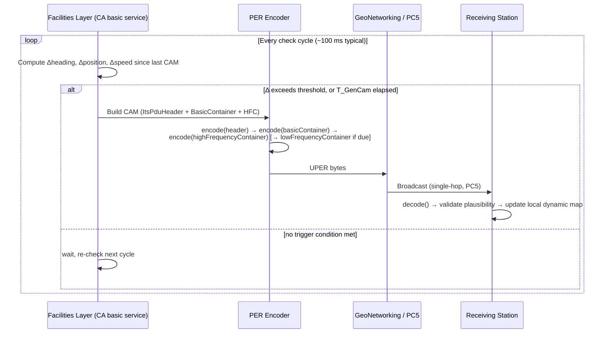
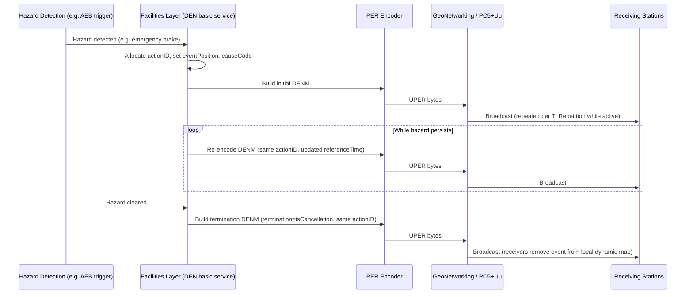

**Last reviewed: 2026-07-19**

# Message Flow Diagrams

Two representative flows: CAM (periodic beacon, dynamically-triggered cadence) and DENM (event-triggered, lifecycle-managed). These are the two trigger models nearly every other facilities message follows a variant of — see [`README.md`](README.md) for which message follows which pattern.

## CAM — periodic, dynamically-triggered cadence

CAM generation isn't a fixed timer — the transmission interval is bounded between a minimum and maximum, but re-triggered early if heading, position, or speed changes beyond a threshold. This is a facilities-layer rule (not a PER encoding concern), but it's the thing most from-scratch implementations get subtly wrong first.

**Why this matters for a codec implementer:** the encoder itself doesn't decide *when* to fire — that's facilities-layer trigger logic sitting above your `PerWriter`. Keep that separation clean: your runtime/compiler only cares about "given a populated CAM struct, produce bytes," never about cadence policy. Conflating the two is a common design smell to watch for.

## DENM — event-triggered, with lifecycle

DENM has state a CAM doesn't: an event ID, a repeat count/interval while the hazard persists, and explicit cancellation/negation semantics when it no longer applies.

**Why this matters:** the extension-addition / open-type handling we designed the runtime around shows up here concretely — `causeCode`'s subcause enumerations and the `alacarte` container are exactly the kind of extensible, optional-heavy structure that exercises the SEQUENCE preamble bitmap and extension path hardest. A good test corpus should include DENMs that populate several optional containers, not just the mandatory minimum — that's a more realistic fuzzing/differential-testing seed than a minimal-field DENM would be.

## Suggested next diagrams for this file

- CPM object-list assembly (sensor fusion → PerceivedObjectContainer → fragmentation path at scale)
- SPATEM/MAPEM pairing at an intersection (how a receiver correlates the two by `intersectionId`)
- Security envelope wrap/unwrap boundary (where TS 103 097 signing sits relative to facilities-layer encode/decode — useful to draw explicitly given the COER/PER boundary decision in the runtime design doc)
